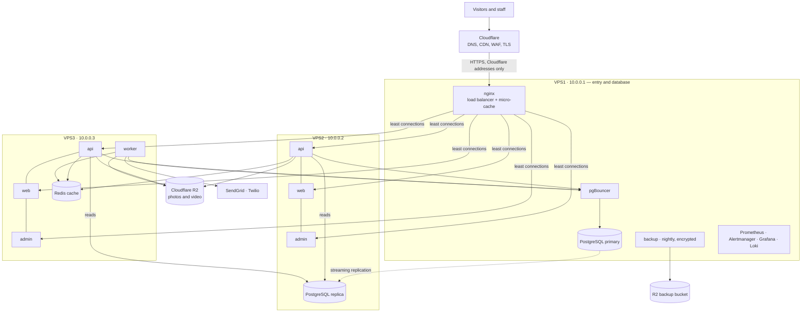

# Brookrege — system architecture

Brookrege is a property listing and lead platform for Sohag: a public website (Arabic first, English optional),
an admin dashboard for staff, and an API behind both. This page is the map; each section links to the detailed
document. Why things are the way they are: `docs/DECISIONS.md` (numbered decisions).

## 1. The pieces

| Part | Code | Technology | Job |
|---|---|---|---|
| Public website | `apps/web` | Next.js 14 (app router), Tailwind | Listings, search, map, compounds, projects, inquiry and "add your property" forms. `/ar` and `/en`, light/dark. |
| Admin dashboard | `apps/admin` | Next.js 14 | Staff UI (English). Every action goes through the API; the admin has no database access of its own. |
| API | `apps/api` | Express, Prisma, PostgreSQL 15 | Public read API, admin API, sign-in/2FA, media processing, notifications, analytics, privacy tools. |
| Worker | `apps/api/src/worker.ts` | same image as the API | Background jobs: emails/SMS, video posters, scheduled reports, clean-ups. |
| Shared rules | `packages/domain` | plain TypeScript, no dependencies | Listing rules, permissions, password policy, media sizes, expiry — used by all three apps so UI and API agree. |
| Edge | `infra/nginx`, Cloudflare | nginx 1.27 | TLS, rate limits, micro-cache, security headers, admin/public split. |
| Data | PostgreSQL + replica, Redis, R2 | | Database (primary on VPS1, streaming replica on VPS2), cache (Redis on VPS3), photos/videos (Cloudflare R2). |
| Operations | `infra/monitoring`, `infra/backup`, `scripts/deploy` | Prometheus, Grafana, Loki, Alertmanager | Metrics, logs, alerts, encrypted backups, deploys with automatic rollback. |

## 2. Production layout (three servers)



The servers talk over a private WireGuard network (10.0.0.x); only nginx on VPS1 is reachable from the internet, and
only from Cloudflare. The same code also runs on **one server** (`docker-compose.prod.yml`) — that is how Phase 1
launched, and how staging runs. Details: `docs/PHASE2-WEEK5.md`, `docs/security/INFRASTRUCTURE.md`.

## 3. A request, end to end

```mermaid
sequenceDiagram
  participant B as Browser
  participant C as Cloudflare
  participant N as nginx (VPS1)
  participant W as web (Next.js)
  participant A as api
  participant K as cache (memory → Redis)
  participant D as PostgreSQL
  B->>C: GET /ar/properties?type=VILLA
  C->>N: (not cached at the edge: HTML)
  alt micro-cache hit (≤10 s old)
    N-->>B: page (X-Cache: HIT)
  else miss
    N->>W: proxy
    W->>A: GET /api/properties?type=VILLA
    A->>K: public:properties:{hash}
    alt cache hit
      K-->>A: JSON
    else miss
      A->>D: SELECT … (replica)
      D-->>A: rows
      A->>K: store (30 min; cleared on any admin change)
    end
    A-->>W: JSON
    W-->>N: HTML
    N-->>B: HTML (stored for 10 s)
  end
  B->>A: POST /api/properties/:id/view (beacon; counts the view)
```

Admin requests (`admin.brookrege.com`) are never cached; they carry `__Host-` cookies that only the admin origin
accepts. Performance numbers and cache rules: `docs/operations/PERFORMANCE.md`.

## 4. Inside the API

```
apps/api/src
  app.ts            Express app: security headers, CORS, metrics, health, routers, error handler
  server.ts         HTTP server + scheduler (unless JOBS_WORKER=false) + metrics server :9464
  worker.ts         job runner only (VPS3)
  config/env.ts     all settings, validated with zod; refuses to start in production/staging with insecure values
  modules/
    public/         listings, search, map, compounds, projects, sitemap, inquiries, submissions, view beacon
    admin/          listings, catalog, leads, team, dashboard, settings (mounted under /api/admin)
    auth/           sign-in, 2FA (TOTP + backup codes), sessions, refresh-token rotation
    security/       lockout, IP allowlist, security policy, session list
    media/          upload → sniff → sharp (3 WebP sizes) → R2 / disk; video posters via the worker
    notifications/  SendGrid / Twilio over fetch, templates, delivery log
    analytics/      KPIs, charts, top listings, Excel/CSV export, scheduled reports
    privacy/        find / export / erase a person's data, retention clean-up
    jobs/           queue (PostgreSQL table, FOR UPDATE SKIP LOCKED), retries with back-off
  jobs/             scheduler (node-cron, Africa/Cairo) and the nightly expiry
  lib/              prisma (primary + replica), cache (two-level), metrics registry, audit log, errors, totp…
  metrics/          Prometheus metrics and database gauges
```

**Data model** (`apps/api/prisma/schema.prisma`): `Property` (with `PropertyMedia` → `MediaAsset`), `Region`,
`Compound`, `Project`, `Inquiry`, `PropertySubmission`, `PropertyViewDaily`, `User`, `AdminSession`,
`RefreshToken`, `BackupCode`, `AuditLog` (append-only, enforced by a database trigger), `Setting`, `Job`,
`NotificationTemplate`, `NotificationLog`, `ReportSchedule`.

**Scheduled work** (Cairo time): listing expiry 02:00 · media clean-up 03:30 · personal-data retention 04:10 ·
"expiring soon" digest Sundays 09:00 · due scheduled reports every 15 min · database backup 01:00 UTC. Each runs
once across all servers (PostgreSQL advisory locks).

## 5. Security layers (outside in)

Cloudflare WAF and bot rules → origin accepts Cloudflare only (firewall + optional authenticated origin pulls) →
nginx rate limits and probe blocking → API rate limits, zod validation on every input, upload sniffing →
admin: origin check, `__Host-` SameSite=Strict cookies, server-side sessions (60 min idle, 12 h max), lockout,
2FA, optional IP allowlist, role permissions from `packages/domain` → audit log of every change → encrypted
backups, encrypted provider keys. Full description: `docs/security/README.md`.

## 6. Operations

| Topic | Where |
|---|---|
| Deploy, rollback, releases | `docs/operations/DEPLOYMENT-RUNBOOK.md` |
| Staging | `docs/operations/STAGING.md` |
| Monitoring, dashboards, alerts | `docs/operations/MONITORING.md`, `docs/operations/RUNBOOKS.md` |
| Performance and load tests | `docs/operations/PERFORMANCE.md` |
| Backups and restore | `docs/security/BACKUPS.md` |
| Incidents | `docs/security/INCIDENT-RESPONSE.md` |
| API reference | `docs/api/index.html` (open in a browser), `docs/api/openapi.yaml` |
| Launch | `docs/launch/` |
