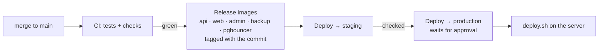

# Deployment runbook

How a change gets from `main` to the live site, how to undo it, and what to do when a deploy stops.
First-time server installation is in `docs/DEPLOYMENT.md` (one server) and `docs/PHASE2-WEEK5.md` (three servers);
this page assumes those are done.

## How it works



On the server, `scripts/deploy/deploy.sh` does, in order: settings and disk checks → nginx test with the new
configuration → download images → **encrypted backup** → **database migrations** → switch containers →
**health checks** (the API must report the new release) → on failure, **switch back automatically**. Nothing
running is touched before the switch step; every run is logged in `/var/lib/brookrege/deploy/history.log` and
reported to monitoring (`DeployFailed` alert).

A **release** is a commit id, 12 characters (e.g. `3f9c2a1b7d04`), shown in GitHub › Actions › Release images.

## One-time setup

1. **Repository variables** (Settings › Secrets and variables › Actions › Variables): `PUBLIC_DOMAIN`
   (brookrege.com), `WHATSAPP_NUMBER`, `STAGING_DOMAIN` (staging.brookrege.com).
2. **Environments** `staging` and `production` (Settings › Environments). For each: secrets `DEPLOY_SSH_KEY`,
   `DEPLOY_KNOWN_HOSTS`; variables `DEPLOY_HOST`, `DEPLOY_TARGET` (`staging`, `single` or `cluster`). On
   `production` add the owner under **Required reviewers**.
   - Key pair made only for this: `ssh-keygen -t ed25519 -f brookrege-deploy -C github-deploy` — private key into
     the secret, public key appended to `/home/deploy/.ssh/authorized_keys` on the server (VPS1 for the cluster).
   - `DEPLOY_KNOWN_HOSTS`: run `ssh-keyscan -t ed25519 <server>` and **compare the fingerprint** with
     `ssh-keygen -lf /etc/ssh/ssh_host_ed25519_key.pub` run on the server itself.
   - If SSH is limited to office addresses (`30-firewall.sh --ssh-from`), GitHub can't reach the server: deploy
     from the server instead (next section), or allow SSH for everyone (keys only + fail2ban remain).
3. **On each server** (as `deploy`, in `/opt/brookrege`):
   - the repository is a clone with a read-only **deploy key** (GitHub › Settings › Deploy keys) so `git fetch` works;
   - the registry login, with a GitHub token that can only read packages:
     `echo <token> | sudo docker login ghcr.io -u <github-user> --password-stdin`
     (fine-grained token, "read:packages" only; renew before it expires — put the date in the calendar);
   - `IMAGE_REGISTRY=ghcr.io/<owner>/brookrege` in the settings file (`.env.production`, `.env.cluster` or `.env.staging`);
   - `sudo mkdir -p /var/lib/brookrege/deploy`.
4. **Three servers only:** VPS1's deploy user must reach VPS2/VPS3 over the private network:
   `ssh-keygen -t ed25519` on VPS1, add its `.pub` to `/home/deploy/.ssh/authorized_keys` on VPS2 and VPS3, then
   `ssh deploy@10.0.0.2 true` and `ssh deploy@10.0.0.3 true` once (accept the host keys).
5. **First deploy** on each environment is done by hand (below) so you watch it once.

## Deploy

**From GitHub (normal way):** Actions › **Deploy** › Run workflow › environment `staging`, release
`<commit>` › Run. Check staging (list below). Then the same with `production`; the owner approves it.

**From the server (if GitHub is down, or SSH is office-only):**

```bash
cd /opt/brookrege && git fetch
sudo scripts/deploy/deploy.sh --target single --tag <release>      # one server
sudo scripts/deploy/deploy.sh --target staging --tag <release>     # staging
scripts/deploy/deploy-cluster.sh <release>                         # three servers, run on VPS1
```

The cluster script updates VPS1 (backup, database pool, nginx), then VPS2 (runs the migrations), then VPS3;
while one app server restarts, the other serves everyone. If any server fails, all are switched back.

**After every production deploy (5 minutes):**
- open the home page, a search, a listing, the English site; submit nothing;
- sign in to the admin, open Listings and Inquiries;
- Grafana › Overview: error rate flat, latency normal, no new alerts, for 15 minutes.

**When not to deploy:** Thursday after 16:00, Fridays, public holidays, during a campaign launch, or when
nobody can watch for the next hour. Database-heavy migrations: early morning.

## Rollback

```bash
# GitHub: Actions › Deploy › environment production › action "rollback"
sudo scripts/deploy/rollback.sh --target single            # back to the release before the current one
sudo scripts/deploy/rollback.sh --target single --tag <release>   # to a specific release
scripts/deploy/deploy-cluster.sh --rollback                # three servers (on VPS1)
```

A rollback switches the **code** back in about a minute. It does **not** undo database migrations — they are
written to keep the previous release working (`docs/DEVELOPER-GUIDE.md` › Migrations). Only if the previous
release fails *because of* a migration: restore the pre-deploy backup (`docs/security/BACKUPS.md` › Real restore) —
that loses changes made since the deploy, so it is the owner's decision.

Running `rollback.sh` twice goes forward again (the previous release is always the one before the current).

## When a deploy stops

The last lines of the output say which step failed. Nothing was switched unless it says "switching back".

| Message | Meaning | Fix |
|---|---|---|
| `settings file … is missing` | wrong server or folder | run from `/opt/brookrege`; copy the `.example` file |
| `only N MB free on disk` | disk nearly full | `docker system prune -f`; old backups (`docs/security/BACKUPS.md`) |
| `release … isn't in the repository` | typo, or not pushed | copy the id from Actions › Release images |
| `nginx rejects the new configuration` | an nginx change is broken | fix in a new commit (`scripts/check-nginx.py` shows it); the running nginx is untouched |
| `couldn't download the images` | release workflow not finished/failed, or registry login expired | wait for Release images to finish; `docker login ghcr.io` again |
| `pre-deploy backup failed` | backup container problem | `docker compose logs backup`; see RUNBOOKS › BackupTooOld. Don't skip the backup for production. |
| `database migration failed` | the database refused a migration | read the error; fix the migration in a new commit. Prisma may mark it failed: `npx prisma migrate resolve --rolled-back <name>` inside the api container after fixing. |
| `… is unhealthy … switching back` → `rolled back` | new release didn't start or answer | site runs the previous release. Look at `docker compose logs --since 30m api web`; fix and redeploy. |
| `rollback … is ALSO unhealthy` | something outside the release is broken (database, disk, settings) | RUNBOOKS › SiteDown |
| `another deploy is running` | two deploys at once | wait; the lock clears when it finishes |

## Hotfix

Same path, faster: branch from `main`, fix, pull request with one reviewer, merge, wait for Release images
(~8 minutes), deploy to staging, check the one thing, deploy to production. Never edit files on the server.

## Where things are on a server

| What | Where |
|---|---|
| Code and compose files | `/opt/brookrege` (a git checkout of the running release) |
| Settings (secrets) | `/opt/brookrege/.env.production` / `.env.cluster` / `.env.staging` (chmod 600) — `IMAGE_TAG` in it is the running release |
| Deploy history and state | `/var/lib/brookrege/deploy/` (`history.log`, `current-<target>`, `previous-<target>`) |
| Deploy metric | `/var/lib/node_exporter/textfile/brookrege_deploy_<target>.prom` |
| Backups | `./backups` (one server) or `/srv/brookrege/backups` (VPS1), plus R2 |
