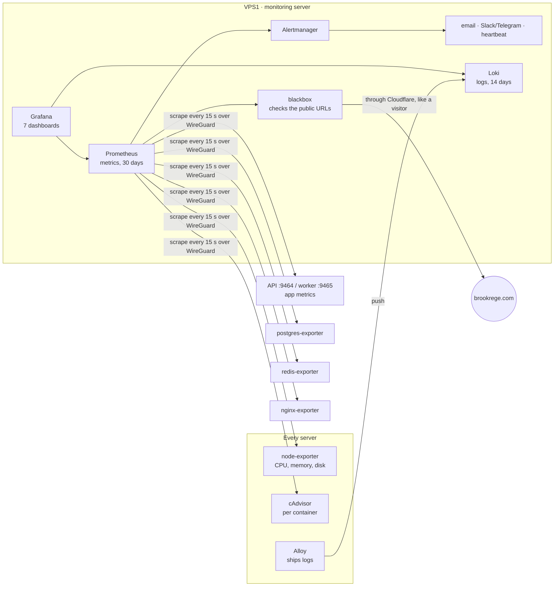

# Monitoring, logs and alerts (Phase 4 · Week 13)

What runs, where, how to install it, how to look at it, and what is kept for how long.
When an alert arrives, go to **[RUNBOOKS.md](RUNBOOKS.md)** — every alert links to its section.

## What runs where



- **Everything listens on private addresses only** — `127.0.0.1` for the dashboards (you reach them through an SSH tunnel), `10.0.0.x` for what the other servers must reach. Nothing monitoring-related is published to the internet; the firewall (`30-firewall.sh`) allows these ports on the private network only, from VPS1.
- **Single server (Phase 1):** the same components, all on one machine and `127.0.0.1`.
- **Memory:** about 700 MB on VPS1 for Prometheus + Loki + Grafana + Alertmanager, plus ~100 MB of agents per server. If VPS1 gets tight on memory, move `infra/monitoring/docker-compose.yml` to a small separate VPS — nothing else changes except `MON_PRIVATE_IP` and the WireGuard peer list.

### Why Loki instead of the ELK stack
The roadmap named ELK (Elasticsearch, Logstash, Kibana). Elasticsearch alone needs 2–4 GB of memory to run reliably, which is most of a Brookrege VPS. **Grafana Loki** does the same job for our volume (search and filter logs, count errors, keep them 14 days) in ~200 MB, and it lives in the same Grafana as the metrics, so one place shows both. **Grafana Alloy** ships the logs (Promtail, the older shipper, reached end of life in 2026).

## Install

Order: agents on every server → monitoring server on VPS1 → check.

```bash
# 0. once, on VPS1 (single server: the only server) — secrets, one file each, readable only by root
sudo install -d -m 700 /etc/brookrege/monitoring/secrets
sudo sh -c 'openssl rand -hex 16 > /etc/brookrege/monitoring/secrets/grafana_admin_password'
sudo sh -c 'echo "<SendGrid API key>" > /etc/brookrege/monitoring/secrets/smtp_password'
# optional: slack_webhook_url, telegram_bot_token (+ TELEGRAM_CHAT_ID in .env.monitoring), heartbeat_url
sudo chmod 600 /etc/brookrege/monitoring/secrets/*
bash scripts/ops/create-monitoring-role.sh          # read-only DB role for the exporter (+ pg_stat_statements)
#    cluster: COMPOSE="docker compose -f infra/servers/vps1/docker-compose.yml --env-file .env.cluster" bash scripts/ops/create-monitoring-role.sh
#    and copy /etc/brookrege/monitoring/secrets/pg_monitor_password to VPS2 (same path) for the replica's exporter.

# 1. agents — on EVERY server (values per server below)
sudo install -d -m 755 /var/lib/node_exporter/textfile
cd /opt/brookrege/infra/monitoring/agents
MON_BIND=10.0.0.1 SERVER_NAME=vps1 LOKI_URL=http://10.0.0.1:3100/loki/api/v1/push MON_PG_HOST=10.0.0.1 \
  COMPOSE_PROFILES=postgres,nginx docker compose --env-file ../../../.env.cluster up -d

# 2. monitoring server — VPS1
cd /opt/brookrege
cp .env.monitoring.example .env.monitoring && nano .env.monitoring      # domains, alert email, SMTP
python3 infra/monitoring/configure.py --topology cluster              # or: --topology single
docker compose -f infra/monitoring/docker-compose.yml --env-file .env.monitoring up -d

# 3. re-apply the firewall so the monitoring ports are open on the private network only
sudo bash infra/provision/30-firewall.sh setup --role vps1 --cloudflare-only   # (each server, its own role)
```

| Server | `MON_BIND` | `SERVER_NAME` | `COMPOSE_PROFILES` | Other |
|---|---|---|---|---|
| VPS1 | 10.0.0.1 | vps1 | `postgres,nginx` | `MON_PG_HOST=10.0.0.1` |
| VPS2 | 10.0.0.2 | vps2 | `postgres` | `MON_PG_HOST=10.0.0.2` (replica) |
| VPS3 | 10.0.0.3 | vps3 | `redis` | `MON_REDIS_HOST=10.0.0.3`, `REDIS_PASSWORD` from `.env.cluster` |
| Single | 127.0.0.1 | web1 | `postgres,nginx,redis` | `LOKI_URL=http://127.0.0.1:3100/loki/api/v1/push`, `MON_PRIVATE_IP=127.0.0.1` in `.env.monitoring` |

**Heartbeat (recommended, free):** create a check at healthchecks.io (or Better Stack) with a 5-minute period and put its ping URL in `secrets/heartbeat_url`. Alertmanager pings it every minute through the always-firing `Watchdog` alert; if VPS1 or the monitoring stack dies, *healthchecks.io* emails you. Without this, nobody notices when monitoring itself is down.

**From outside (recommended, free):** add an external uptime monitor (UptimeRobot / Better Stack) for `https://brookrege.com/ar` — the blackbox checks run on VPS1, so they can't report VPS1 being unreachable.

### Check it works
```bash
ssh -L 3000:127.0.0.1:3000 -L 9090:127.0.0.1:9090 -L 3100:10.0.0.1:3100 deploy@<vps1>
python3 scripts/monitoring/verify-dashboards.py     # every dashboard query + every rule, against the live system
```
Then send a test alert end to end:
```bash
docker compose -f infra/monitoring/docker-compose.yml exec alertmanager amtool alert add alertname=TestAlert severity=warning server=vps1 \
  --annotation=summary="Test alert — please ignore" --annotation=runbook=docs/operations/RUNBOOKS.md --alertmanager.url=http://127.0.0.1:9093
```
An email should arrive within a minute (and resolve after 5 minutes).

## Looking at it

**Grafana:** `ssh -L 3000:127.0.0.1:3000 deploy@<vps1>`, open http://127.0.0.1:3000, user `admin`, password from `secrets/grafana_admin_password`. Dashboards are in the *Brookrege* folder; they're provisioned from the repository (read-only in the UI — change `scripts/monitoring/build_dashboards.py`, re-run it, commit).

| Dashboard | Answers |
|---|---|
| **Overview** | Is the site up from outside? Errors, response time, firing alerts, last backup, today's leads |
| **Application (API)** | Requests by status and route, p50/p95/p99, slowest routes, memory/CPU/event-loop, version running, error log |
| **Database** | Primary/replica up, replication lag, connections, cache hit ratio, TPS, rows, deadlocks, fallback-to-primary |
| **Servers & containers** | CPU, memory, disk, load, network per VPS; CPU/memory per container; nginx connections |
| **Business** | Listings by status, expiring soon, leads per hour, waiting leads, messages sent/failed |
| **Security** | Failed/successful sign-ins, lockouts, blocked admin requests, 401/403/429, nginx status mix, SSH/fail2ban log |
| **Background jobs & cache** | Queue depth, oldest waiting job, job outcomes and run time, cache hit ratio (L1/L2), Redis memory and evictions, worker log |

**Logs (Grafana › Explore › Loki):**

| Looking for | Query |
|---|---|
| API errors | `{service=~"api\|worker", level="error"}` |
| One request by its ID (the `x-request-id` response header) | `{service="api"} \|= "<request id>"` |
| Server errors at the load balancer | `{service="nginx", status_class="5xx"}` |
| A visitor's requests (IP) | `{service="nginx"} \| json \| remote_addr="41.33.10.5"` |
| Slowest requests | `{service="nginx"} \| json \| request_time > 2` |
| SSH sign-ins | `{job="journal", unit="ssh.service"} \|= "Accepted"` |

## Alerts

38 rules in `infra/monitoring/prometheus/rules/alerts.yml`, each tested in `prometheus/tests/alerts_test.yml` where the logic isn't trivial.

| Severity | Examples | Who, how fast |
|---|---|---|
| **critical** | SiteDown, AllApiServersDown, HighErrorRate, PostgresDown, DiskSpaceCritical, BackupTooOld/Failed | email + Slack/Telegram at once; repeated every 2 h until fixed |
| **warning** | TargetDown, HighLatency, ReplicationLag, DiskSpaceLow, MemoryLow, HighCPU, JobQueueStuck, MessagesFailing, CertificateExpiresSoon, FailedSignInSpike | email; repeated every 12 h |
| **info** | AccountLocked, AdminRequestsBlocked, LeadsWaiting, NoLeadsFor3Days | email, at most hourly, repeated daily |

Noise control: related alerts are grouped per server; when the site is down, symptom alerts (errors, latency) are suppressed; a critical alert suppresses the warning version of itself. Performance targets from the roadmap are built in: **p95 < 500 ms** (HighLatency), error rate < 5%.

## What is kept, and for how long

| Data | Kept | Where set |
|---|---|---|
| Metrics | 30 days, capped at 8 GB (older data dropped first) | `PROMETHEUS_RETENTION`, `PROMETHEUS_RETENTION_SIZE` |
| Logs in Loki (include visitors' IP addresses) | 14 days, then deleted by the compactor | `infra/monitoring/loki/loki.yml` `retention_period` |
| Container logs on each server | 5 × 20 MB per container (API) / 3 × 10 MB (monitoring) | Docker `daemon.json`, compose `logging:` |
| Alert history | 5 days (Alertmanager default) | — |
| Activity log (who changed what) | forever; IP and browser blanked after 12 months | Admin › Privacy › Retention |
| Backups | 14 daily + 12 monthly | `infra/backup/backup.sh` |

These are listed in the privacy notice (`docs/security/PRIVACY.md`); change both together.

## Files

```
infra/monitoring/
  docker-compose.yml            Prometheus, Alertmanager, Grafana, Loki, blackbox (VPS1)
  agents/docker-compose.yml     node-exporter, cAdvisor, Alloy + postgres/nginx/redis exporters (every server)
  configure.py                  renders generated/ (targets for the topology, public URLs, alert routing)
  prometheus/prometheus.yml     scrape jobs (targets from generated/targets)
  prometheus/rules/             recording.yml, alerts.yml      prometheus/tests/  alert unit tests
  prometheus/targets/{single,cluster}/                         who to scrape
  alertmanager/                 alertmanager.template.yml, brookrege.tmpl (email/chat text)
  grafana/                      provisioning/, dashboards/ (generated), dashboards.queries.json
  loki/loki.yml  alloy/config.alloy  blackbox/blackbox.yml
scripts/monitoring/  build_dashboards.py · verify-dashboards.py · check.sh (CI)
apps/api/src/metrics/  the app's own metrics (registry.ts, collectors.ts, server.ts)
```

## How it was tested

With the real binaries of the pinned versions (Prometheus 3.5.0 LTS, Alertmanager 0.28.1, Loki 3.5.5, Alloy 1.10.2, node/postgres/redis/blackbox exporters) running against a real PostgreSQL, Redis and a process serving the app's actual metric registry:
`promtool check`/`test rules` (all alert tests pass), `amtool check-config` for every notification combination, `promtool check metrics` on the app's output, **every one of the 86 dashboard queries run against live data (78 returned data, 8 empty only because cAdvisor/nginx/replica/journal weren't present, 0 errors)**, all 45 rules evaluating, alerts firing and routed to the right receivers, and logs from Docker containers shipped by Alloy into Loki with the `level` and `status_class` labels the dashboards use. Grafana itself couldn't be run here (its download is blocked); its dashboards are validated structurally and by running their queries.
