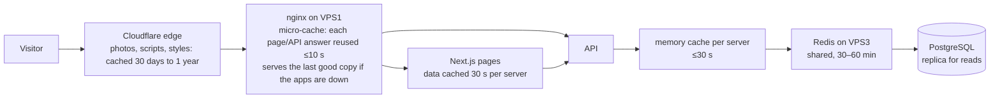

# Performance (Phase 4 · Week 14)

Targets from the roadmap: **API p95 < 500 ms**, **LCP < 2.5 s, INP/FID < 100 ms, CLS < 0.1**, and handling
**10,000 simultaneous visitors**. This page explains what was changed, what was measured, and how to measure
the rest on the real servers.

## The layers, fastest first



| Layer | What | How long | How it's refreshed |
|---|---|---|---|
| Cloudflare | `/_next/static/*` (1 year), photos: R2 media (1 year) and `/uploads` (30 days) | as set by the origin — the files never change (new content = new file name) | not needed |
| nginx micro-cache | public pages and public API (`GET`), anonymous only | 10 s (404: 5 s) | expires; one request refreshes while others get the previous copy |
| Next.js | data behind each page | 30 s | expires (ISR) |
| API memory (L1) | listings, search, map, summaries, compounds, projects, regions | ≤ 30 s | **cleared immediately on every admin change** (all servers, via Redis) |
| Redis (L2) | same | search 30 min, listing 1 h, catalog 1 h | **cleared immediately on every admin change** |

**Never cached:** the admin (every request goes to the app), anything with a sign-in cookie, forms and other
`POST`s, the health check (`/api/health`), Next.js client navigations (`RSC` header). Response header
`X-Cache: HIT/MISS/BYPASS/STALE/UPDATING` shows what nginx did.

**How fresh is the public site after an edit?** An admin change clears the API caches at once; nginx and
Next.js may show the previous version for up to ~40 s (10 s + 30 s). A listing that reaches its expiry date
disappears within 30 minutes (the nightly job also clears the cache).

**Views** are now counted by a tiny request the listing page sends from the visitor's browser
(`POST /api/properties/:id/view`) instead of when the page is generated — otherwise caching pages would
lose views. Bots, link previews and repeat views (same visitor, same listing, 30 min) aren't counted.

## Database

Measured on a copy with **40,000 listings, 120,000 photos, 60,000 inquiries and 400,000 daily-view rows**
(far more than Brookrege will have for years), PostgreSQL, `EXPLAIN ANALYZE`:

| Query | Before | After | Why |
|---|---|---|---|
| Listings, newest first (page 1) | 30.4 ms | **0.18 ms** | partial index in sort order (`Property_public_newest_idx`) |
| Listings, page 40 | 18.9 ms | 1.4 ms | same |
| Count of matching listings | 12.9 ms | 4.8 ms | index-only scan (`Property_public_expiry_idx`) |
| Region filter | 3.8 ms | 0.8 ms | same partial index |
| Text search "فيلا" | 39.5 ms | **2.7 ms** | trigram indexes (`pg_trgm`) on title, English title, address |
| Text search, rare word | 42.6 ms | 0.26 ms | same |
| "Starting from" per type | 15.5 ms | 7.0 ms | index-only scan |
| Compound summaries | 14.6 ms | 6.4 ms | same |
| Admin listing table | 19.5 ms | **0.1 ms** | `Property_admin_updated_idx` |
| Analytics "top listings" (30 days) | **3,120 ms** | 215 ms | query rewritten: aggregate once, then join (was one subquery per listing) |

Migration: `apps/api/prisma/migrations/20260930000000_phase4_performance`. These partial and trigram indexes
can't be expressed in `schema.prisma`; if `prisma migrate dev` ever proposes dropping them, delete those
lines from the generated migration.

### Finding slow queries
- Every query slower than **500 ms** is written to the PostgreSQL log (`PG_SLOW_QUERY_MS`):
  `docker compose logs postgres | grep "duration:"`.
- Top queries by total time (needs `scripts/ops/create-monitoring-role.sh` once, which enables `pg_stat_statements`):
  ```sql
  SELECT calls, round(mean_exec_time::numeric, 1) AS avg_ms, round(total_exec_time::numeric) AS total_ms, left(query, 150)
  FROM pg_stat_statements ORDER BY total_exec_time DESC LIMIT 15;
  ```
- Then `EXPLAIN (ANALYZE, BUFFERS) <the query>` — look for `Seq Scan` on big tables and `Sort` before `Limit`.
- Grafana › Database shows the cache hit ratio (should stay above 99%) and connections.

### Connection pools
| Where | Setting | Value | Why |
|---|---|---|---|
| Single server, API | `connection_limit` in `DATABASE_URL` | 15 | one API process; PostgreSQL `max_connections` 100 |
| Cluster, each API | `connection_limit` (writes / replica) | 10 / 5 | 2 API servers + worker = 45 client connections |
| Cluster, pgBouncer | `default_pool_size` (`POOL_SIZE`) | 25 per database | real PostgreSQL connections; transaction pooling |
| PostgreSQL | `max_connections` | 200 (cluster) | headroom for pgBouncer, replication, monitoring (3), admin psql |

Rule of thumb: raise `connection_limit` only if Grafana › Application shows requests waiting while the
database is idle (low CPU, few `active` connections). More connections than CPU cores × 4 on the database
usually makes things slower, not faster.

## Front end

- **Bundle:** the site has three runtime libraries (Next.js/React, Leaflet, the shared domain package). The
  map library (Leaflet, the largest) loads only on the map page, after the page is shown.
- **Fonts:** one family (IBM Plex Sans Arabic), self-hosted by Next.js, `font-display: swap`; reduced from
  4 to the 3 weights actually used.
- **Images:** WebP in 480/960/1600 px (Phase 2), `srcset` + `sizes` so phones download the small one, lazy
  loading below the fold; the main photo on a listing page (the largest element, LCP) now loads first with
  high priority; the first project photos load eagerly.
- **Pages:** listing pages are cached (ISR, 30 s) instead of rendered for every visitor.
- **Home film:** the first frame (90 KB) is the largest element and loads first; the film (6.2 MB desktop /
  3.9 MB phone) starts downloading only after the page has loaded, and never with reduced motion or data saver.
  Served with a one-year cache (versioned folder). Details: `docs/HOME-FILM.md`.
- **Not measurable here:** real Core Web Vitals need the deployed site. After deployment run
  [PageSpeed Insights](https://pagespeed.web.dev/) on `/ar`, `/ar/properties` and one listing (mobile), or
  `npx lighthouse https://brookrege.com/ar --preset=perf --form-factor=mobile`. Google's field data
  (Search Console › Core Web Vitals) appears after a few weeks of traffic.

## Load testing

Script: `tests/load/brookrege.js` (k6). Visitors open the home page, search (random type / transaction /
region), open listings, sometimes the map or compounds, with realistic pauses between clicks.
Pass criteria (thresholds): API p95 < 500 ms, pages p95 < 1.5 s, < 1% failed requests.

**Before a test** (otherwise you measure the protections, not the site):
1. Use **staging**, or production at night with the owner's agreement. `WRITE=1` (inquiries) only on staging.
2. On VPS1 allow the load generator's address past the *browsing* limits (sign-in and form limits still apply):
   `echo '203.0.113.5 "";' | sudo tee /etc/brookrege/cloudflare/loadtest-allow.conf && docker compose exec nginx nginx -s reload`
3. In Cloudflare add a temporary custom rule: *IP Source Address equals 203.0.113.5 → Skip* (all WAF components, Bot Fight Mode off for it).
4. **After the test:** delete the file, reload nginx, remove the Cloudflare rule.

```bash
k6 run -e BASE_URL=https://staging.brookrege.com -e PROFILE=smoke tests/load/brookrege.js   # 5 visitors, 1 min
k6 run -e BASE_URL=… -e PROFILE=1k tests/load/brookrege.js                                 # ramp to 1,000 over 12 min
```
Profiles `5k` and `10k` need more than one machine (a single laptop or CI runner tops out around 1–2k
simulated visitors): use k6 Cloud with the same script, or run it on 3–5 small VPSs at once (each with its
address allowed). GitHub › Actions › *Load test* runs it from a CI runner.

**What was verified here:** the script runs end to end (smoke profile through the real nginx configuration
with stand-in app servers: 0% errors, all checks passed); the thresholds evaluate. **The 1k/5k/10k results
must come from the real servers** — numbers from this build environment would say nothing about the VPSs.

### Capacity estimate (to be confirmed by the 10k test)
A simulated visitor makes ~7 requests per ~25 s visit ≈ 0.3 requests/s, so 10,000 simultaneous visitors ≈
3,000 requests/s reaching nginx (Cloudflare already serves photos and scripts). The catalog has a few thousand
distinct URLs at most, so with the 10-second micro-cache the app servers see roughly *(distinct URLs requested
in 10 s) ÷ 10* requests/s — typically a few hundred at most, served mostly from Redis. The expected limits, in
order: nginx CPU on VPS1 (TLS from Cloudflare + gzip), then Next.js rendering on cache misses. If the 10k test
fails its thresholds, the first steps are: raise VPS1 to 4 vCPU; let Cloudflare cache HTML for 60 s with a Cache
Rule (safe because pages don't vary by cookie); add a third app server (`docs/PHASE2-WEEK5.md`).

## Capacity: when to scale
| Signal (Grafana) | Action |
|---|---|
| VPS1 CPU > 70% at peak for a week | Upgrade VPS1 (nginx + DB primary) |
| API p95 > 300 ms at peak, app CPU high | Add an app server (compose file of VPS3 as template) |
| DB cache hit ratio < 99%, disk reads rising | More memory for PostgreSQL (`PG_SHARED_BUFFERS` ≈ 25% of RAM) |
| Redis evictions > 0 and hit ratio falling | Raise `REDIS_MAXMEMORY` |
| Memory on VPS1 < 15% free | Move the monitoring stack to its own small VPS |
